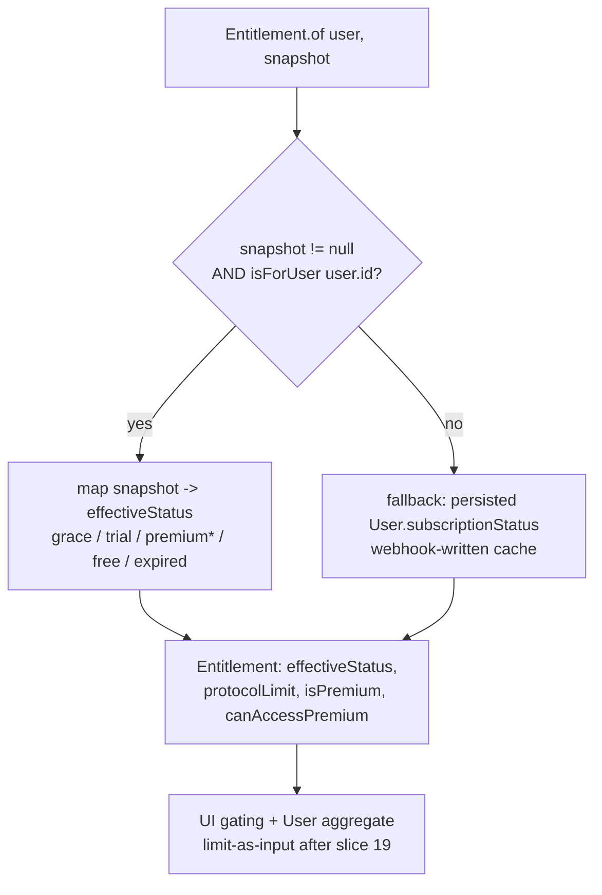
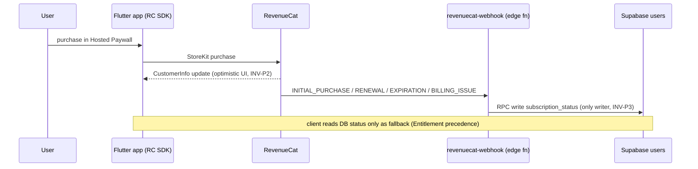
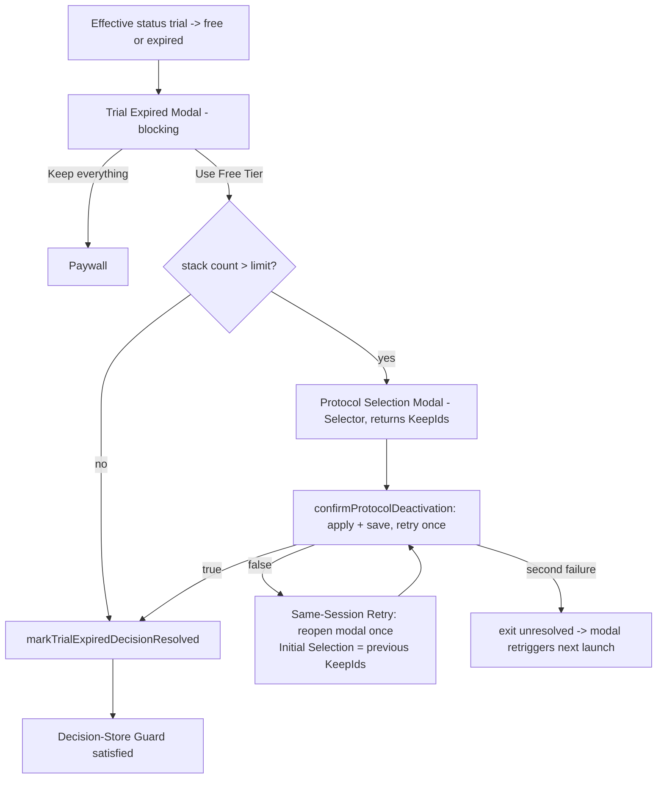
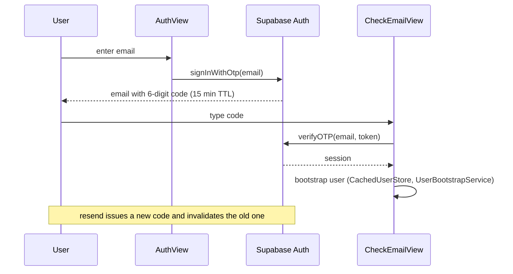

# NeuroStack documentation audit — 2026-07-09

Documentation-as-product audit: does every reader-facing doc tell the truth about the code, lead with what matters, sit at the right size, and show architecture as drawn process rather than prose? Read in full: README, `docs/**` (specs, best-practices, investigations, changelogs, legal, agents, ADR), the 15 root-level plan/notes files, `.sandcastle/` agent docs, doc-bearing code and config (`pubspec.yaml`, `env/`, `supabase/config.toml` + email template, `tool/` scripts, `.vscode/`, key public docstrings), and both existing diagrams. Corpus ≈ 100 reader-facing files / ≈ 17,000 lines. Seven parallel read-only sub-agents each read their cluster end-to-end and verified claims against `lib/`, `test/`, `supabase/`, and git history; every finding's anchor was then **re-verified first-hand** by the orchestrating auditor in a final pass. That pass retracted two sub-agent-reported findings that did not survive first-hand reading (see §4 NOT REPRODUCED) — the disprove-first rule applied to the audit itself. Working tree untouched except this report. Maintainer owns git.

Companion audits from the same day are cross-referenced, not re-derived: `docs/audits/codebase-audit-2026-07-09.md` (`C1`–`C45`) and `docs/audits/process-audit-2026-07-09.md` (`P1`–`P11`). Where a defect is fundamentally code or process, this report keeps only the documentation-specific evidence.

**Verdict in one paragraph:** the *inner* documentation ring is unusually good — the glossary, ADR-0001, the feature specs, and the testing guides are accurate, cross-linked, and mostly verified true against code. The *outer* ring is where readers actually enter, and it fails them: the README describes a different product, the agent entry file points at two files that don't exist, the doc index promises content its first two links don't contain, and the only auth architecture guide teaches a flow the project formally abandoned in ADR-0001. Add 15 working files squatting in the repo root, an index that omits 12+ documents, and exactly two diagrams in the whole repo, and the pattern is clear: docs are written well at feature time and never re-visited when the system moves.

Findings: **24** — Critical 1 · High 5 · Medium 12 · Low 6. Evidence: CONFIRMED 22 · CONFIRMED+PLAUSIBLE 1 · PLAUSIBLE 1. Two additional candidates investigated and retracted (NOT REPRODUCED). Render verification of Mermaid: BLOCKED (no renderer run; source-inspected).

---

## 1. Summary table

| ID | Sev | Document | One-line issue | Evidence |
|----|-----|----------|----------------|----------|
| D1 | Critical | `README.md` | Front door is the upstream "Hungrimind Flutter Boilerplate" README — wrong product, principles the repo contradicts, and an env instruction that sends config to a path the app never reads; no doc anywhere says how to run the app | CONFIRMED (cross-ref P2, P3) |
| D2 | High | `AGENTS.md` (=`CLAUDE.md`), `docs/agents/domain.md` | Agent entry docs point to `docs/agents/backlog.md` and root `CONTEXT.md` (both missing) while `domain.md` still claims `docs/adr/` "does not exist yet" (ADR-0001 exists) | CONFIRMED (cross-ref C12, P4) |
| D3 | High | `docs/README.md:4-5` | Quick Start promises "build commands, architecture overview … environment setup" in CLAUDE.md and "coding style, commit conventions, PR guidelines" in AGENTS.md — the target is one 13-line pointer file containing none of it | CONFIRMED |
| D4 | High | `docs/best_practices/architecture/mvvm_and_ddd_supabase_magic_link_authentication.md`, `docs/specs/20260113143000_spec_auth.md`, screen-prompts 09/10 | Superseded magic-link auth still documented as current across four surfaces despite ADR-0001 (2026-06-21) switching to one-time code | CONFIRMED (cross-ref C11) |
| D5 | High | `docs/best_practices/integration_test.md` | Documents robot classes, Patrol, and 4-shard CI that do not exist anywhere (`integration_test/robots/` absent, Patrol not in pubspec, no CI job runs integration tests) | CONFIRMED (cross-ref C37, P9, C10) |
| D6 | High | `docs/README.md` | The only navigation surface omits 3 of 17 specs, 9 of 12 investigations, 3 root plans, ADR-0001, `docs/agents/*`, and `.sandcastle/` — and lists the deprecated cronjob spec without its DEPRECATED status | CONFIRMED |
| D7 | Medium | `docs/best_practices/architecture/mvvm_and_ddd_guide.md` | Core domain primitives cited at `lib/core/domain/*` — actual location is `lib/core/models/common/*` (entity, domain_event, aggregate_root + the whole project-structure section) | CONFIRMED |
| D8 | Medium | `docs/ubiquitous-language.md:503,582-583,614` | Glossary defines Minimum splash duration as "500ms" in four places; code and newer docs say 1000ms (`startup_view_model.dart:106`) | CONFIRMED (cross-ref C37) |
| D9 | Medium | `docs/ubiquitous-language.md:11,173,194,608` | Epic #16 ⏳ markers say Entitlement/TrialExpiryPolicy vocabulary "has not shipped yet" / "Lands in #17" — slices #17 and #18 merged (commits `b405559`, `98159b3` → `f7d2e77`); the doc's own rule says delete markers on merge | CONFIRMED |
| D10 | Medium | `docs/best_practices/design/screen-functional-specifications.md`, `docs/specs/20260105234900_spec_home_screen.md`, screen-prompts 02/04 | Bottom nav documented as 3 tabs; code has 4 (`home_bottom_nav.dart:38-58` incl. Settings), as the settings spec and glossary state | CONFIRMED |
| D11 | Medium | `docs/best_practices/design/visual-design.md:124,263,305`, `docs/README.md:120-122` | Design tokens documented as `AppSpacing`/`AppBorderRadius`/`AppShadows`; classes are `CustomSpacing`/`CustomBorderRadius`/`CustomShadows` | CONFIRMED |
| D12 | Medium | `docs/best_practices/design/screen-functional-specifications.md` | Staleness bundle: §10 titled "Deactivation Modal" (glossary flags as legacy ×4 uses), "All 5 protocols" (catalog is 60), unqualified "splash screen" | CONFIRMED |
| D13 | Medium | `docs/best_practices/test/domain/04-result-assertions.md:179-182` | Teaches `isSuccessWith`/`isFailureWith` custom-Result matchers that don't exist in this repo; real matchers are fpdart `isRightWith`/`isLeftWith` (`test/matchers/either_matchers.dart:6-18`), documented separately in 07 | CONFIRMED |
| D14 | Medium | `plan_trial_expiration_cron_job.md` | Presents pg_cron trial expiration as current with no deprecation banner; migration `20260213194806_remove_expire_trials_cron.sql` removed it (the spec twin *does* carry a DEPRECATED banner) | CONFIRMED |
| D15 | Medium | repo root (15 files) | 11 completed implementation plans + `prompt.md` + `protocols2.md` + `notes_citation_url_normalization.md` + `integrate_userorient.md` live at the root; all plan features shipped and have spec twins — no archive convention | CONFIRMED |
| D16 | Medium | `docs/investigations/*` | Documented follow-ups never landed: `protocol_sources.md` never created; `json_coverage_count_conflict` cell fixes not applied; settings work-pack P0 (missing `11-settings.png`) and P1 (widget tests) open; `todo.md` is an orphan fragment starting at item "3." | CONFIRMED (artifacts) / PLAUSIBLE (work-pack status) |
| D17 | Medium | `docs/ubiquitous-language.md:74,132-137,328,616` | Micro-drift inside the canonical glossary: Category misses `Cold Exposure` (code enum has 7 values and cites the glossary for them); "Trial Status (enum)" doesn't exist in code; annual saving is $35.89, not $36.89; line 616 claims `onCancelSubscriptionTap` "persists in specs and code" — it persists in neither (rename to `onManageSubscriptionTap` completed) | CONFIRMED |
| D18 | Medium | repo-wide | Exactly two diagrams exist (both in changelogs); startup state machine, entitlement resolution, webhook pipeline, trial-expired orchestration, and OTP sign-in are prose-only — see §6 backlog with skeletons | CONFIRMED |
| D19 | Low | `docs/README.md:95-107` | "Core Infrastructure (Well-Documented in Code)" oversells: `connectivity_service.dart` has zero doc comments; `router_service.dart` has 6 `///` lines in 297 | CONFIRMED |
| D20 | Low | `supabase/auth/email/magic-link.html`, `supabase/config.toml:174-176`, `docs/README.md:152` | Live OTP code email still named/indexed "magic link" (file name, config key, index description, `ValueKey('auth_magic_link')`) — content is current, names are legacy | CONFIRMED (cross-ref P5 for deployment gap) |
| D21 | Low | `docs/README.md` | Index quality: titled "NeuroStack Specifications" though it is the whole doc map; `lib/offline/` should be `lib/features/offline/` (line 143); newcomer path buried; spec-bootstrap template pasted at the bottom of a reference index | CONFIRMED |
| D22 | Low | `docs/best_practices/design/screen-prompts/*` (17 files) | One-shot AI design-generation prompts indexed as living docs; screens shipped long ago — history, not reference (09/10 additionally stale per D4) | CONFIRMED |
| D23 | Low | `pubspec.yaml:2` | Doc-bearing config: `description: "A new Flutter project."` plus stock template comments — the manifest says nothing true about the app | CONFIRMED |
| D24 | Low | `docs/changelogs/` | Changelog category stopped 2026-01 after three entries — vestigial mode; either retire or make per-feature changelogs a convention | PLAUSIBLE |

Retracted after first-hand re-verification (details in §4): the settings spec's "Restore Purchases (not included)" note (already struck through and annotated with fn-81) and the paywall plan's §5.3 Restore-Purchases claim (an accurate History note recording the fn-81 re-implementation).

---

## 2. Doc map — current vs proposed

### 2.1 Current map (what exists, what it claims, who it serves)

| Surface | Mode | Intended reader | State |
|---|---|---|---|
| `README.md` (37 ln) | explanation/how-to | newcomer | **Wrong product** (D1) |
| `AGENTS.md` = `CLAUDE.md` (13 ln, symlink) | reference (pointers) | agents | 2 of 3 pointers dead (D2) |
| `docs/README.md` (177 ln) | index/map | everyone | Only nav surface; incomplete + overselling (D3, D6, D19, D21) |
| `docs/ubiquitous-language.md` (625 ln) | reference (glossary + invariants) | devs + agents | **Canonical CONTEXT.md stand-in; strongest doc in repo**; drift at edges (D8, D9, D17) |
| `docs/adr/0001` (26 ln) | ADR | devs | Excellent; unindexed (D6) |
| `docs/agents/` (3 files) | reference | agents | Good; `domain.md` stale re ADRs (D2) |
| `docs/best_practices/architecture/` (4 files, ~1,950 ln) | explanation + how-to | devs | mvvm guide path drift (D7); magic-link guide superseded (D4); other two accurate |
| `docs/best_practices/conventions.md`, `general_structure_and_guidelines.md` | reference | devs | Verified accurate |
| `docs/best_practices/design/` (4 guides + 17 prompts + 1 png) | reference + generated artifacts | devs/design | Token names (D11), 3-tab + legacy headings (D10, D12), prompts are history (D22) |
| `docs/best_practices/test/` (10 files, ~2,850 ln) | how-to/reference | devs | Verified against real suite; one copy-paste trap (D13) |
| `docs/best_practices/integration_test.md` (839 ln) | how-to/reference | devs | ~40% fiction (D5) |
| `docs/specs/` (17 files, ~5,000 ln) | reference ("what is built and why") | devs + agents | Mostly verified true; 3 unindexed; auth spec stale (D4); two staleness suspicions disproved on re-read (§4) |
| `docs/investigations/` (12 + `todo.md`) | postmortem/runbook | maintainer | High quality; 9 unindexed; some follow-ups unlanded (D16) |
| `docs/changelogs/` (3 files) | changelog + the repo's only 2 Mermaid diagrams | maintainer | Diagrams still valid; category vestigial (D24) |
| `docs/legal/research-findings.md` (406 ln) | explanation/research | maintainer + lawyer | Solid research memo; feeds future ToS/PP work |
| Root: 11 `plan_*.md` + `integrate_userorient.md` (~5,600 ln) | point-in-time implementation plans | nobody (done) | All shipped; archive (D14, D15) |
| Root: `protocols2.md`, `notes_citation_url_normalization.md`, `prompt.md` | research dump / debt note / scratch | maintainer | Two worth keeping somewhere findable; one delete candidate (D15) |
| `.sandcastle/` (3 files) | agent harness prompts/standards | autonomous agents | Consistent with repo standards; `{{TARGET_BRANCH}}` is a template var (cross-ref P7) |
| Doc-bearing code/config | — | devs | `env/default.env.json` key comments good; `pubspec.yaml` description boilerplate (D23); docstring density uneven (D19) |
| Excluded from audit scope | — | — | `.flow/**` (~250 files: working state of a tool dropped 2026-05-11, plus `usage.md`), `.agents/skills/revenuecat/**` (vendored third-party reference), `.claude/commands/*` (tooling prompts), `node_modules`, platform boilerplate |

There is no `CONTRIBUTING.md`, no `specs/**/quickstart.md` pattern, and no getting-started document anywhere.

### 2.2 Proposed map (a maintainer can execute this directly)

Moves/renames only — content fixes are in §5.

```
README.md                      ← REWRITE (D1): what NeuroStack is, 10-line quickstart
                                 (env/env.json + --dart-define-from-file, run, test,
                                 codegen), links into docs/. Boilerplate marketing out.
AGENTS.md (CLAUDE.md symlink)  ← FIX pointers (D2): issue-tracker.md, ubiquitous-language.md
                                 as the CONTEXT.md stand-in, docs/adr/ exists.
docs/
  README.md                    ← Index ONLY, retitled "NeuroStack Documentation Map".
                                 One line per doc + status tag ([CURRENT]/[DEPRECATED]/
                                 [HISTORY]). Add missing 12+ entries (D6). Drop the
                                 "well-documented in code" essays (D19) → one line each.
                                 Move the spec-bootstrap template → docs/guides/authoring-specs.md.
  getting-started.md           ← NEW (missing-docs #1): env, run, test, build_runner,
                                 gen-l10n, supabase local, tool/verify.sh vs CI.
  ubiquitous-language.md       ← KEEP UNIFIED (it works as the single context doc);
                                 fix D8/D9/D17. Add Mermaid state/flow diagrams (§6).
  adr/                         ← 0001 stays; backfill list in §7 (webhook-only writer,
                                 entitlement precedence, offline-first sessions,
                                 drop pg_cron, brightness policy, hosted paywall).
  guides/                      ← RENAME best_practices/ (shorter, mode-honest).
    architecture/
      mvvm_and_ddd_guide.md            ← fix paths (D7)
      supabase_integration.md          ← as-is (drop the mvvm_and_ddd_ prefix)
      app_launch_and_handoff.md        ← as-is
      auth_one_time_code.md            ← NEW, replaces magic-link guide (D4);
      _archive/magic_link_authentication.md  ← moved, banner "superseded by ADR-0001"
    design/
      visual-design.md                 ← fix token names (D11)
      brightness_theming.md, ui_widget_guidelines.md ← as-is
      screen-functional-specifications.md ← keep as the one wireframe atlas BUT:
        add per-section status banner + "canonical spec →" link to docs/specs/…;
        fix D10/D12. (Do NOT split into 11 files — the per-feature specs already
        exist; this doc's remaining job is the cross-screen atlas.)
    testing/                           ← merge test/domain/ + test/data-layer/ into one
                                         folder, keep 00-07 numbering; index.md lists all
                                         ten; 04 gets a "this repo uses fpdart → see 07"
                                         banner (D13)
    integration_test.md                ← delete fiction sections or mark ASPIRATIONAL
                                         with tracking issue (D5)
  specs/                       ← all 17 indexed; every spec gets the header block
                                 spec_auth already models (Type/Status/Last-Updated);
                                 deprecated ones tagged in the index (D6)
  investigations/              ← all indexed with one-line status (RESOLVED-BY/OPEN);
                                 todo.md → absorbed into issues or deleted (D16)
  plans/                       ← NEW: archive the 11 root plans + integrate_userorient.md
                                 verbatim, each with 3-line header: STATUS/shipped-in/
                                 spec-twin (D14, D15)
  research/
    protocols-community-research.md   ← protocols2.md moved (source-of-truth for why
                                        each protocol exists)
    citation-url-normalization.md     ← notes_… moved (open debt note), or → issue
  design-history/              ← screen-prompts/ + design_screenshots/ moved with a
                                 5-line README: generation artifacts, not specs (D22)
  changelogs/                  ← decide: retire (fold Mermaid diagrams into the two
                                 specs) or adopt as convention (D24)
  legal/, audits/, agents/     ← as-is
(root)                          prompt.md ← delete candidate (stale scratch; maintainer confirms)
```

Splits: none needed beyond extractions above — no doc is too big once its fiction/duplication is removed. Merges: test docs into one folder; screen prompts into an archive. The glossary stays whole deliberately: at 625 lines with a table of contents by section, it is the repo's context anchor and splitting it would scatter the single source of truth.

---

## 3. Coverage accounting

**Read fully (by auditor + named sub-agent, all end-to-end):**
- Orchestrator first-hand: `README.md`, `docs/README.md`, `AGENTS.md`, `docs/agents/*` (3), `docs/adr/0001`, `docs/ubiquitous-language.md`, `prompt.md`, both companion audit reports, `.github/workflows/test.yaml`, `pubspec.yaml`, `tool/verify.sh`, `.vscode/settings.json`, `env/default.env.json`, `.gitignore`, `supabase/config.toml` (auth sections), `supabase/auth/email/magic-link.html`, key code anchors (`subscription_status.dart`, `entitlement.dart`, `user.dart` guards, `startup_view_model.dart:106`, `category.dart`, `evidence_level.dart`, `home_bottom_nav.dart`).
- Agent-arch: 7 architecture/convention/integration-test guides (~3,350 ln).
- Agent-design: 4 design guides + 17 screen prompts + screenshot (~2,700 ln).
- Agent-test: 10 testing docs (~2,850 ln) + cross-check against 72 test files.
- Agent-specs-A: 9 specs Jan-2026 (~3,700 ln). Agent-specs-B: 8 specs Feb–May 2026 (~1,850 ln).
- Agent-inv: 12 investigations + `todo.md` + 3 changelogs + legal research + `.sandcastle/` (3).
- Agent-root: 15 root-level plan/notes files (~5,600 ln incl. the 1,759-line paywall plan).

**Skimmed:** none silently — everything in scope was a full read.

**Excluded (with reason):** `.flow/**` (working state of a tooling system dropped 2026-05-11 — not reader-facing; ~250 files), `.agents/skills/revenuecat/**` (vendored third-party API reference), `.claude/commands/*.md` (editor tooling prompts), `.prompts/` (audit task specs), platform template files (`ios/…/LaunchImage…/README.md`), `node_modules`, generated `.g/.freezed` code. `specs/**/quickstart.md`: pattern does not exist in this repo.

**Commands/checks run (read-only):** ~60 grep/ls/read verifications across `lib/`, `test/`, `integration_test/`, `supabase/migrations|functions|auth`, `tool/`; `git log` for slice-merge status; arithmetic re-check of pricing claims; Mermaid source syntax inspection (2 diagrams); plus a final first-hand re-verification battery covering every finding anchor (which retracted two sub-agent findings — §4). No app build, no test run, no DB, no network, no credentialed calls (the process audit already exercised the command surface on a throwaway clone — P1–P3, P11).

**Blind spots (BLOCKED, with the check I would run):**
1. Mermaid render fidelity — `npx -y @mermaid-js/mermaid-cli -i <extracted>.mmd -o /tmp/out.svg` (needs network install; source syntax inspected instead, both PLAUSIBLE-valid).
2. DB-state claims ("59 distinct rows after lower(name) upsert", seed contents) — `supabase db reset && psql -c 'select count(*) from protocols'` (needs local Docker stack).
3. RevenueCat dashboard claims (entitlement literally named "Neurostack Pro", paywall template config, P7D trial on Test Store) — RevenueCat dashboard/API with credentials; deliberately not touched.
4. Hosted Supabase email-template deployment state (Dashboard-only for hosted projects; `config push` does not deploy template bodies) — Dashboard inspection; cross-ref P5.
5. Live UI copy screenshots (e.g., check-email screen wording) — `flutter run` + manual walk; static code strings verified instead.

---

## 4. Drift verification log

Every accuracy claim tested, with the check and result. Format: doc claim → source of truth checked → observed reality → reader impact.

| # | Doc claim (where) | Check run | Observed reality | Impact / label |
|---|---|---|---|---|
| 1 | "copy `env/default.env.json` to `env.json`" (`README.md:31`) | read `.vscode/settings.json`, `.gitignore` | run config reads `env/env.json`; `.gitignore` ignores `/env/env.json`; root `env.json` is never read | Newcomer configures a file the app ignores → D1, cross-ref P2 |
| 2 | Boilerplate claims: "CLI… Discord… only essential Flutter/Dart-team packages" (`README.md:9-27`) | read `pubspec.yaml` | 15+ third-party deps (supabase, RevenueCat, userorient, fpdart, freezed…); no CLI in repo | Front door describes another product → D1 |
| 3 | `docs/agents/backlog.md` exists (`AGENTS.md:5`) | `ls docs/agents/` | file absent; content lives in `issue-tracker.md` | Agent follows dead pointer → D2 |
| 4 | `CONTEXT.md` at repo root (`AGENTS.md:13`) | `ls` | absent; `domain.md` designates `ubiquitous-language.md` as stand-in | Contradiction inside entry docs → D2 |
| 5 | "`docs/adr/` — does not exist yet" (`docs/agents/domain.md:8,21`) | `ls docs/adr/` | ADR-0001 exists (2026-06-21) | Agents told to skip ADRs that exist → D2 |
| 6 | CLAUDE.md contains build commands/architecture/testing/env setup (`docs/README.md:4`) | read `CLAUDE.md`/`AGENTS.md` (13 ln) | none of it present | First index link is a dead end → D3 |
| 7 | Magic-link auth as current (`…magic_link_authentication.md` entire; `spec_auth.md:11,18-19`; prompts 09:17,46 / 10:20,30,44,79) | read ADR-0001; grep `verifyOTP` | `check_email_view_model.dart:70` calls `verifyOTP()`; ADR removes link entirely | Reader implements abandoned flow → D4 |
| 8 | Robot pattern in `integration_test/robots/` (`integration_test.md:281-392`) | `find integration_test/` | no `robots/`; tests use widget keys directly | Test author mimics phantom infra → D5 |
| 9 | Patrol + 4-shard CI (`integration_test.md:573-614`) | grep `pubspec.yaml`; read `test.yaml` | Patrol absent; CI has lint + unit/widget only, integration tests execute nowhere | → D5, cross-ref C10 |
| 10 | Core primitives at `lib/core/domain/…` (`mvvm_and_ddd_guide.md:46,67,79,690-714`) | `ls lib/core/models/common/` | `entity.dart`, `domain_event.dart`, `aggregate_root.dart` live there | Guide's file map wrong → D7 |
| 11 | Minimum splash "500ms" (`ubiquitous-language.md:503,582-583,614`) | read `startup_view_model.dart:106` | `minSplashDuration = 1000ms`; app-launch spec + arch doc say 1000ms | Glossary contradicts code+newer docs → D8 |
| 12 | ⏳ "has not shipped yet… Lands in #17" (`ubiquitous-language.md:11,173,194,608`) | `git log`; `ls lib/paywall/domain/` | slices #17/#18 merged; `entitlement.dart` + `trial_expiry_policy.dart` exist (resolver still does the logic via delegation — that part is accurately described) | Reader believes existing seam is future work → D9 |
| 13 | 3-tab bottom nav (`screen-functional-specifications.md:207,277,338`; `spec_home`; prompts 02/04) | read `home_bottom_nav.dart:38-58` | 4 tabs incl. Settings | Wireframe atlas contradicts shipped IA → D10 |
| 14 | Tokens `AppSpacing`/`AppBorderRadius`/`AppShadows` (`visual-design.md:124,263,305`; `docs/README.md:120-122`) | grep `lib/core/ui/constants/` | classes are `CustomSpacing`, `CustomBorderRadius`, `CustomShadows` (`CustomCurves` was already right) | Copy-paste identifiers fail → D11 |
| 15 | "§10 Deactivation Modal", "All 5 protocols" (`screen-functional-specifications.md:541,457`; prompt 06:26) | glossary line 620; `grep -c '"name":' protocols.json` | glossary declares "Protocol Selection Modal" canonical; catalog = 60 protocols / 85 citations | Legacy vocab + 12× understated catalog → D12 |
| 16 | `isSuccessWith`/`isFailureWith` exist (`04-result-assertions.md:179-182`) | grep `test/` | only fpdart `isRightWith`/`isLeftWith`/`isLeftWithCode` exist (`either_matchers.dart:6-18`) | New dev copies matchers that don't compile against repo helpers → D13 |
| 17 | pg_cron expiration as current (`plan_trial_expiration_cron_job.md` §2, §6.2) | `ls supabase/migrations/`; grep plan for DEPRECATED | `20260213194806_remove_expire_trials_cron.sql` + trial columns dropped `20260213201742`; plan has zero deprecation markers | Implementing from plan adds dead infra → D14 |
| 18 | `protocol_sources.md` to be added (investigation 20260223:57-62) | `ls docs/` | never created | Promised doc missing → D16 |
| 19 | Coverage cells 59/59, 83/83 to be updated (investigation 20260508130000:70-80) | grep specs | not applied | Spec numbers still conflict → D16 |
| 20 | `docs/design_screenshots/11-settings.png` referenced (settings work-pack:68; settings spec) | `git ls-files` | only `trial-expiration-modal.png` exists | Dead artifact reference → D16 |
| 21 | Category = 6 values (`ubiquitous-language.md:74`) | read `category.dart` | 7 values incl. `coldExposure`; the enum's doc comment cites the glossary for all 7 | Glossary behind its own citation → D17 |
| 22 | "Trial Status (enum): active/expired/converted" (`ubiquitous-language.md:132-137`) | grep `TrialStatus` in `lib/` | no such type; trial state now lives in `SubscriptionStatus` + `EntitlementSnapshot` flags (trial columns dropped) | Phantom enum in canonical glossary → D17 |
| 23 | "Annual saves $36.89/year" (`ubiquitous-language.md:328`) | arithmetic: 7.99×12−59.99 | $35.89 (the "37% off" figure is correct) | Off-by-a-dollar in invariant → D17 |
| 24 | `onCancelSubscriptionTap` "persists in specs and code until fn-81 is complete" (`ubiquitous-language.md:616`) | grep spec + `lib/` for both callback names | neither the settings spec nor code contains the old name; code uses `onManageSubscriptionTap` (`settings_support_section.dart:26,49,96`) | Glossary describes a rename as pending that is complete → D17 |
| 25 | "Well-Documented in Code" for connectivity/router/etc. (`docs/README.md:95-107`) | `grep -c '///'` per file | `connectivity_service.dart` 0 doc lines; `router_service.dart` 6/297 | Index oversells code docs → D19 |
| 26 | "Supabase Auth Templates … magic link email templates" (`docs/README.md:152`; file/key names) | read template + `config.toml:174-176,213-215` | template content is the OTP code email ("Enter this code…"); only names are legacy | Misleading naming on live artifact → D20 |
| 27 | "Offline UI Module — `lib/offline/`" (`docs/README.md:143`) | `ls` | actual `lib/features/offline/` | Wrong path in index → D21 |
| 28 | `prompt.md` directs "work on task fn-82" | `git log` | fn-82 shipped (`ff196fc`); tasking system dropped 2026-05-11 | Stale scratch at root → D15 |

**Checks that could not be run (BLOCKED — reason + exact command):**

| # | Doc claim needing the check | Why blocked | Exact command I would have run |
|---|---|---|---|
| B1 | Both changelog Mermaid diagrams render correctly (`docs/changelogs/20260107…`, `20260109…`) | No Mermaid renderer installed; installing requires a network write | `npx -y @mermaid-js/mermaid-cli -i <extracted>.mmd -o /tmp/out.svg` per diagram |
| B2 | "60 seed rows, 59 distinct after lower(name) upsert" (`docs/specs/20260220…:73`, seed migrations) | Requires local Supabase stack (Docker daemon not available/safe here) | `supabase db reset && psql "$LOCAL_DSN" -c 'select count(*), count(distinct lower(name)) from protocols'` |
| B3 | RevenueCat entitlement literally named "Neurostack Pro"; Hosted Paywall + P7D trial configured (`docs/specs/20260123…:14`, glossary INV-M2 note) | Dashboard/API state needs credentials; credential-bound reads are out of bounds per spec | `curl -H "Authorization: Bearer $RC_API_KEY" https://api.revenuecat.com/v2/projects/<id>/entitlements` |
| B4 | The OTP email template in `supabase/auth/email/magic-link.html` is actually deployed to the hosted project (`docs/README.md:152`) | Hosted-project template state is Dashboard-only; `config push` does not deploy template bodies | Manual Dashboard inspection (Auth → Email Templates) — no safe CLI equivalent |
| B5 | Docs-only onboarding dead-ends at runtime exactly as D1 describes | Running the app needs real Supabase credentials; the process audit already walked this journey on a throwaway clone (P2/P3) | `flutter run --dart-define-from-file=env/env.json` after a docs-only setup |

**Tested and held (NOT REPRODUCED — suspicious claims that survived, and audit candidates that were disproved):**
- **Retracted candidate:** "spec_settings_screen.md:179 still says Restore Purchases is out of scope" — first-hand read shows the line is struck through and annotated: `~~Restore Purchases tile (not included)~~ -- Added in fn-81-paywall-apple-compliance`. The spec self-corrected; a sub-agent had quoted the pre-strikethrough text. No finding.
- **Retracted candidate:** "plan_paywall_modal.md §5.3 claims Restore Purchases was never implemented" — line 814 is a **History** note: "Originally marked [DONE] via fn-46-1b8 but never actually implemented. Zombie epic … closed. Re-implemented in fn-81-paywall-apple-compliance.2 …". Accurate record, not stale. No finding.
- Glossary `SubscriptionStatus` table (6 values, limits 2/2/null, `isPremium` incl. grace, `canAccessPremium` incl. trial) — matches `subscription_status.dart:4-23` exactly.
- Glossary claim "User aggregate reads the limit off the enum directly (until #19)" — true today (`user.dart:120,250`); `Entitlement.of` delegates to the resolver exactly as the interim text says.
- OTP template "expires in 15 minutes" vs `config.toml` `otp_expiry = 900` / `otp_length = 6` vs glossary "6-digit code" — all consistent.
- Settings: 6 support tiles as glossary/prompt 11 state; "Manage Subscription" + `canAccessPremium` gate as fn-81 spec states (`settings_view.dart:98`).
- Testing docs: factories, DTO factories, barrel exports, `TestConstants`, `unwrapOrThrow`, matcher file locations — all exist where documented; hard rules (no `Future.delayed`, setUp-fresh mocks, pump-after-tap, boundary tests) verified in the real suite.
- spec_paywall_modal webhook claims — `supabase/functions/revenuecat-webhook` exists; product IDs `neurostack_monthly`/`neurostack_yearly` match the edge function constants.
- protocols.json 60 entries / 85 citations — matches the add-3 spec's updated totals; `tool/generate_seed_sql.dart` exists.
- Changelog Mermaid diagrams — every named artifact (`HomeViewModel`, `LibraryViewModel`, `ProgressViewModel`, `BackdateSessionSheet`, `LogSessionUseCase`, `User.activateProtocol`) still exists; flows match code.
- conventions.md, general_structure_and_guidelines.md, brightness_theming.md ↔ visual-design.md surface-mode policy — internally consistent and true to code.

---

## 5. Findings by hunt category (severity order within each)

### Hunt 1 — Drift / inaccuracy

**D1 (Critical, CONFIRMED) — `README.md` is the wrong product's README.**
Reader scenario: a newcomer (or agent) clones the repo, opens README, learns they're holding the "Hungrimind Flutter Boilerplate" with a CLI and a Discord, follows the only project-specific instruction (`copy env/default.env.json to env.json`), creates a file the app never reads, then finds no run/test/codegen instructions anywhere (`docs/README.md` Quick Start defers to a 13-line pointer file). The docs-only path to a running app does not exist; the one that half-works (VS Code F5) is documented nowhere. The "Minimal Dependencies / Own Your Code" principles are contradicted by `pubspec.yaml`. Direction: rewrite README for NeuroStack with a 10-line quickstart (see §2.2, §7-1); keep any boilerplate provenance note in `docs/`. Cross-ref P2/P3 for the end-to-end journey evidence.

**D4 (High, CONFIRMED) — superseded auth flow documented as current in four places.**
Reader scenario: a dev asked to "touch auth" opens the only auth architecture guide (`mvvm_and_ddd_supabase_magic_link_authentication.md`, 157 ln) or `spec_auth.md` ("Status: Documented") and builds against deep-link magic-link callbacks that ADR-0001 removed after zero successful production sign-ins. ~75% of spec_auth (state hierarchy, invariants, services, routes) survives; the headline, deep-link section, and test-name examples don't. Screen prompts 09/10 script "Send magic link / Tap the link" copy. Direction: write `auth_one_time_code.md` (or update spec_auth's headline + mark the guide superseded-by-ADR-0001); archive the magic-link guide; regenerate or archive prompts 09/10. Cross-ref C11.

**D5 (High, CONFIRMED) — `integration_test.md` documents phantom infrastructure.** Robots (§6, lines 281-392), Patrol (§9, 573-614), sharded CI — none exist; the true parts (pumpUntilFound, test_app, WidgetKeys, locator reset) are verified accurate. Reader scenario: a test author structures new tests around `integration_test/robots/` and Patrol APIs that aren't in the project, then discovers nothing runs integration tests at all. Direction: delete or clearly mark ASPIRATIONAL the fiction sections and open a tracking issue; state in the doc that integration tests currently have no CI executor. Cross-ref C37/P9/C10.

**D7 (Medium, CONFIRMED) — flagship architecture guide cites wrong core paths** (`lib/core/domain/*` → `lib/core/models/common/*`, four spots incl. the project-structure section). Reader scenario: dev follows the guide to add a domain event, creates a parallel `lib/core/domain/` hierarchy or hunts for files that aren't where the map says. Direction: fix the four path references.

**D8/D9/D17 (Medium, CONFIRMED) — the canonical glossary has drifted at its edges** while remaining structurally excellent: 500ms vs 1000ms splash (4 spots); epic-16 ⏳ markers surviving their slices' merges against the doc's own delete-on-merge rule; Category missing `Cold Exposure` (the code enum cites the glossary for the 7 values it actually has); a phantom "Trial Status (enum)"; $36.89 vs $35.89; line 616 describing the `onCancelSubscriptionTap` rename as pending when it is complete. Reader scenario: agents are told to treat this file as authoritative (domain.md) — each error propagates with authority. Direction: one edit pass; add "Last verified against code: <date>" to the header.

**D10/D11/D12 (Medium, CONFIRMED) — design surface lags shipped UI**: 3-tab nav in the wireframe atlas + home spec + prompts vs 4 tabs in code; `App*` token names vs `Custom*` classes (also wrong in the index); legacy "Deactivation Modal" §10 heading the glossary itself flags; "All 5 protocols" vs a 60-protocol catalog. Reader scenario: designer/dev uses the atlas as the cross-screen source of truth and reproduces pre-Settings IA and dead identifiers. Direction: single update pass over `screen-functional-specifications.md` + `visual-design.md`; add per-section "canonical spec →" links.

**D13 (Medium, CONFIRMED) — testing doc 04 ships matcher code that doesn't exist here.** Reader scenario: new dev copies `isSuccessWith` into a test; it doesn't exist — the repo's matchers are fpdart-based and documented in 07. Direction: banner at top of 04 ("this repo uses fpdart Either → see 07; the following is the generic custom-Result pattern"), or rewrite 04 fpdart-first.

**D14 (Medium, CONFIRMED) — the cron plan contradicts the shipped architecture with no warning.** `plan_trial_expiration_cron_job.md` presents pg_cron trial expiration as current; migrations `20260213194806` (cron removed) and `20260213201742` (trial columns dropped) ended it, and the spec twin carries a DEPRECATED banner while the plan carries none. Reader scenario: someone implementing "from the plan" re-adds dead infrastructure. Direction: add the same DEPRECATED banner; archive per D15. Note: two sibling staleness suspicions in this cluster were checked and **disproved** (§4 NOT REPRODUCED) — the settings spec and the paywall plan both self-annotate correctly.

**D20 (Low, CONFIRMED) — legacy "magic link" naming on live OTP artifacts** (template filename, config key, index description, widget ValueKey). Content is correct; names mislead. Direction: rename file + index line when convenient (config key `magic_link` is Supabase's template-type name for OTP emails — keep, but say so in a comment). The undeployable-template process gap is P5's; the doc gap is a missing backend runbook (§7-2).

**D23 (Low, CONFIRMED) — `pubspec.yaml` description is stock.** One-line fix.

### Hunt 2 — Inverted-pyramid violations

Generally good — most guides and specs open with purpose. The violations that matter:

- **D3 (High, CONFIRMED)**: the index's Quick Start — the single most-read two lines in `docs/` — promises content that isn't behind the links. The reader's first routing decision fails. Fix by making the promises true (getting-started doc) and describing AGENTS.md as what it is (pointer file).
- **D21 (Low, CONFIRMED)**: `docs/README.md` buries "how do I run this?" (nowhere), leads with a title claiming to be "Specifications", and ends a reference index with a prompt template (mode mixing). Restructure per §2.2.
- `README.md` (part of D1): leads with boilerplate marketing; the only actionable content (env setup) is the last section — inverted inverted-pyramid.
- Minor, no ID: `spec_settings_screen.md` buries its tile table mid-doc; `spec_rate_app` acceptance list reads long. Not worth churn.

### Hunt 3 — Sizing / decomposition

- **D15 (Medium, CONFIRMED)**: the repo root is a 15-file attic (5,600+ lines) of completed plans, research dumps, and scratch. The split that matters is *root vs docs/*, not file-internal: archive plans → `docs/plans/` with status headers; move research → `docs/research/`; delete `prompt.md` (maintainer confirms). Every plan already has a spec twin, so no content is lost.
- `screen-functional-specifications.md` (725 ln): **keep unified** — the per-screen split already exists as `docs/specs/*`; this doc's surviving value is the cross-screen atlas. What it needs is status banners + links, not fission (D12).
- `docs/ubiquitous-language.md` (625 ln): **keep unified** — it is the context anchor; splitting scatters the single source of truth. Fix drift instead.
- `integration_test.md` (839 ln): right-sizes itself once fiction sections are removed (D5).
- Scattered fragments that should merge: testing docs live in two folders with a domain-only index — merge to one `guides/testing/` with a complete index (agent-verified: content duplication between 01/06 and 04/07 is intentional layering, not drift — keep).

### Hunt 4 — Architecture as drawn process

**D18 (Medium, CONFIRMED)**: two Mermaid diagrams exist in the entire repo (library/progress changelogs — both still accurate). Everything load-bearing is prose: the startup state machine (glossary tables + app-launch spec), entitlement resolution precedence (glossary), the RevenueCat webhook pipeline (paywall spec), the trial-expired orchestration with decision-store guard and same-session retry (glossary dialogue!), the OTP sign-in flow (nowhere current), offline session sync (log-session spec). See §6 for the ranked backlog and skeletons. Existing-diagram staleness: none (both verified; render check BLOCKED, source PLAUSIBLE-valid).

### Hunt 5 — Usefulness / audience fit

- **D22 (Low, CONFIRMED)**: 17 screen prompts are one-shot generation inputs whose screens shipped months ago; as indexed docs they masquerade as specs (two of them teaching the dead auth flow — D4). Archive with a status header; they retain value as design history only.
- **D24 (Low, PLAUSIBLE)**: changelogs stopped after three entries in Jan 2026 — either a convention or a leftover; decide (they currently host the only diagrams, which argues for folding those into the specs).
- `.sandcastle/` docs fit their (agent) audience and match `tool/verify.sh` reality; `{{TARGET_BRANCH}}` is a template variable, not rot (P7 owns the substitution bug).
- Newcomer zero-to-first-success: impossible on docs alone (D1/D3) — the biggest audience-fit failure in the repo.

### Hunt 6 — Coverage

Missing docs are consolidated in §7. Headlines: no getting-started/run doc (the single highest-value gap), no backend/deploy runbook (webhook function, secrets, hosted email template — cross-ref P5), no CI/branching note (CI only fires on `main` while work happens on `develop` — C2; no doc mentions it), no env-var reference beyond template comments, one ADR where at least six decisions deserve records, no error-taxonomy page (DomainFailure `{Aggregate}.{Invariant}` convention is glossary-implied only), **D16 (Medium)**: promised follow-up docs that never landed.

### Hunt 7 — Single source of truth

- Auth flow: stated in 5 places, 4 stale (D4) — canonical home should be ADR-0001 + one current auth guide; everything else links.
- Splash duration: stated in 4 docs; glossary is the outlier (D8) — canonical home: the constant + app-launch spec; glossary should reference, not restate, the number.
- Protocol limit "2": the glossary handles this *well* (one canonical rule, facets as anchors) — the code duplication is C17's problem, not the docs'.
- Token names: two docs restate class names; both wrong the same way (D11) — index should stop restating and just link.
- Tab count/catalog size: restated in atlas + prompts + specs (D10/D12) — per-feature specs are canonical; atlas links out.
- Terminology: glossary's "aliases to avoid" is the right mechanism and mostly obeyed; violations are concentrated in pre-glossary docs (atlas §10, prompts 09/10).

### Hunt 8 — Findability / navigation

**D6 (High, CONFIRMED)**: `docs/README.md` is the only map and it omits: specs `trial_expiration_modal`, `paywall_apple_compliance`, `add_3_community_protocols`; 9 of 12 investigations; plans `add_3_community_protocols`, `log_session_modal`, `paywall_apple_compliance`; ADR-0001; `docs/agents/*`; `.sandcastle/`; `docs/legal` is indexed ✓. A maintainer hunting "why did trials stop using pg_cron?" cannot route to the (excellent, deprecated-marked) cronjob spec's replacement story or the unindexed investigations. Also: deprecated spec listed with no status tag; **D2** breaks the agent entry route; **D19/D21** degrade trust in the map (overselling, wrong `lib/offline/` path, wrong title). Direction: index everything with status tags; the index's job is routes, not essays.

---

## 6. Diagram backlog (value order)

| # | Process (currently prose) | Type | Target home |
|---|---|---|---|
| 1 | App startup state machine (InitializingApp → AppInitialized / OfflineNoUserState / AppInitializationError, retry + router invalidation) | stateDiagram | `docs/best_practices/architecture/app_launch_and_handoff_to_flutter.md` (+ glossary links to it) |
| 2 | Entitlement resolution precedence (snapshot-scoped ⊃ persisted status; where Entitlement/TrialExpiryPolicy sit vs resolver) | flowchart | `docs/ubiquitous-language.md` § Subscription State (or the paywall spec, glossary links) |
| 3 | RevenueCat purchase→webhook→DB→client pipeline (who writes what; INV-P2/P3 optimistic vs authoritative) | sequence | `docs/specs/20260123220000_spec_paywall_modal.md` |
| 4 | Trial-expired orchestration (modal → selector → save-retry → decision-store guard → same-session retry) | flowchart | `docs/specs/20260120120000_spec_trial_expiration_modal.md` |
| 5 | OTP sign-in flow (email → code → verifyOTP → bootstrap; resend/invalidate rule) | sequence | the new `auth_one_time_code.md` (D4) |
| 6 | Offline-first session sync (pending queue, sync triggers) | sequence | `docs/specs/20260113180000_spec_log_session_modal.md` |
| 7 | Seed pipeline (protocols.json → generate_seed_sql → migration → idempotent upsert) | flowchart | `docs/specs/20260220120000_spec_protocol_description_and_seed.md` |

Skeletons for the top five (drop-in, adjust labels while editing):

```mermaid
stateDiagram-v2
    [*] --> InitializingApp : runApp()
    InitializingApp --> AppInitialized : BootstrapResult.initialized
    InitializingApp --> OfflineNoUserState : BootstrapResult.offlineNoUser
    InitializingApp --> AppInitializationError : bootstrap throws
    AppInitializationError --> InitializingApp : Retry (flip-before-disposal)
    OfflineNoUserState --> InitializingApp : Retry
    note right of InitializingApp
        Future.wait(bootstrap, 1000ms splash floor)
        idempotent Supabase init guard
    end note
    note right of AppInitialized
        BestRouterConfig created lazily here;
        invalidated when state leaves AppInitialized
    end note
```











Render verification of these and the two existing diagrams: BLOCKED locally (would run `npx -y @mermaid-js/mermaid-cli`); source syntax inspected.

---

## 7. Missing-docs backlog (by unblocking value)

1. **`docs/getting-started.md`** — env (`env/env.json` + `--dart-define-from-file`), run, `flutter test`, `build_runner`, `gen-l10n`, supabase local (`supabase start`/`db reset` + seed caveat, cross-ref P6), `tool/verify.sh` vs CI differences (cross-ref C32). Unblocks: every newcomer and agent; converts D1/D3 fixes from pointers into content.
2. **Backend runbook** — deploy `revenuecat-webhook` (`supabase functions deploy` + secrets), RevenueCat webhook config, hosted email template must be set in the Dashboard (config push does not deploy template bodies), env key provisioning. Unblocks: the monetization + sign-in backbone from being tribal knowledge. Cross-ref P5.
3. **ADR backfill (6 candidates)** — webhook as sole subscription-status writer (INV-P3); entitlement resolution precedence + user-scoped snapshot; offline-first append-only sessions; drop pg_cron for webhook-driven expiry; brightness/dark-first route policy; RevenueCat Hosted Paywall over custom paywall. Each exists as scattered rationale in plans/specs/glossary today; ADRs make them findable and citable (the glossary's "Design principles" block is already 80% of the first two).
4. **CI & branching note** (README or CONTRIBUTING) — what CI runs, that it triggers on `main` only (C2), format-version pitfalls (C23/P1), PR conventions the index already promises exist (D3).
5. **Env & config reference** — one table: key → consumed by → failure mode if missing (C16 makes the failure mode invisible at runtime).
6. **Error taxonomy page** — DomainFailure `{Aggregate}.{Invariant}` convention + failure-code catalog (currently one line in the index + code).
7. **`docs/research/protocol_sources.md`** — the page investigation 20260223 promised; protocols2.md + citations are the raw material (D16).
8. **Auth guide (current flow)** — covered under D4; listed here because it's also a coverage gap: no current-state auth doc exists at all.

---

## 8. What held up

- **`docs/ubiquitous-language.md`** — as a *structure*: canonical-rule pattern with numbered facets, "aliases to avoid", Flagged Ambiguities, and a dialogue that teaches. Verified accurate on the SubscriptionStatus table, both premium flags, the protocol-limit operators, the OTP terms, the 6 settings tiles. Its drift (D8/D9/D17) is edge-wear, not rot.
- **ADR-0001** — model ADR: context with production evidence, considered options, honest consequences, links to its investigation.
- **Spec discipline where it exists** — cronjob spec's DEPRECATED banner; protocol-seed spec's fn-82 UPDATE note; spec_auth's Type/Status/Last-Updated header (the *format* is right even where the content aged); **the settings spec's strikethrough-plus-annotation on its out-of-scope list and the paywall plan's History note both survived adversarial re-verification** — exactly the self-correcting pattern the other plans lack.
- **Testing docs 00-07 + index** — hard rules verified against the real suite; factory/matcher/constants locations all true; intentional layering, no harmful duplication.
- **`conventions.md`, `general_structure_and_guidelines.md`, `app_launch_and_handoff_to_flutter.md`, `mvvm_and_ddd_supabase_integration_supplement.md`** — path- and pattern-accurate.
- **`brightness_theming.md` ↔ `visual-design.md`** — the two theming policies agree with each other and the code (incl. the CI token guard).
- **Both changelog Mermaid diagrams** — every named class still exists; flows still correct.
- **Investigations** — resolution banners on the resolved ones; the magic-link postmortem is the best root-cause doc in the repo and directly seeded ADR-0001.
- **`env/default.env.json`** — placeholder comments that actually explain each key (publishable vs anon key note included).
- **`.sandcastle/CODING_STANDARDS.md`** — matches `tool/verify.sh` and repo patterns.

---

## 9. Open questions (maintainer-only)

1. `prompt.md` — delete, or is it a live personal template? (Delete candidate per D15; maintainer call.)
2. Changelogs — retire the category or adopt it as a per-feature convention? The two diagrams inside should move to the matching specs either way (D24).
3. Screen prompts — is archiving to `docs/design-history/` acceptable, or are they still used to regenerate designs (in which case 09/10 need regenerating for OTP anyway)?
4. `protocols2.md` — agree to relocate under `docs/research/`? It's the only record of *why* each protocol is in the catalog.
5. Glossary epic-16 markers — clean up now to reflect "seam exists, logic still in resolver until #21", or wait for #21 and delete wholesale? (D9 recommends now; the doc's own rule says per-merge.)
6. `README.md` — should any Hungrimind boilerplate provenance remain (e.g., a one-line credit), or full replacement?
7. Mermaid rendering — worth adding `@mermaid-js/mermaid-cli` (or GitHub-native rendering reliance) so diagram render checks stop being BLOCKED?
8. `citation-url-normalization` debt note — keep as a doc or convert to a tracked issue and delete the file?
