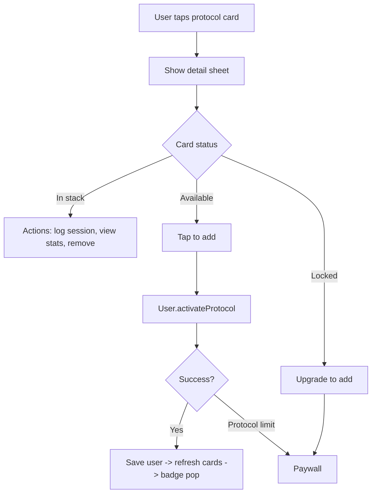

# Library Screen Change Log

This document tracks the Library screen implementation. Keep it current as the app evolves.

## What changed

### New state and view model
- Added `LibraryViewState`, `LibraryProtocolCardModel`, `LibrarySectionModel`, `LibraryProtocolStats`, and related enums to drive screen state.
- Implemented `LibraryViewModel` to load protocols, build cards/sections, handle offline state, and coordinate bottom tab navigation.
- Added on-demand stats loading for the detail sheet (`loadStats`).
- Added add/remove protocol flows with paywall routing on limit reached.

### New UI and widgets
- Implemented the Library layout with AppGridBackground, header, offline banner, section headers, cards, and bottom nav.
- Added staggered fade/slide-in animations for banner, header, and cards.
- Added protocol cards with spotlight hover effect, dashed locked border, and badge actions.
- Added detail sheet with evidence, citations, stats, and action CTAs.
- Added category header widget using Inter 12px uppercase styling.

### Cache and offline behavior
- Added a per-user protocol cache persisted in SharedPreferences.
- Library now hydrates from cached user/protocols when offline, and refreshes on reconnect.
- Cached user is updated on successful add/remove protocol saves.

### UI helper consolidation
- Centralized evidence color and status label/color helpers in `lib/library/library_ui.dart`.

### Navigation behavior
- Bottom navigation uses `HomeBottomNav` and `HomeBottomTabCoordinator`.
- Progress tab remains a toast-only stub ("Coming soon").

### Tests
- Added widget tests for card status labels/icons and category headers.

## Flow diagram

## What did not change (intentionally)

### Not implemented yet
- Real-time updates for stack/protocol/session changes.
- Log session flow (still a toast stub).
- Progress tab routing (still a toast stub).
- Localization for Library strings (inline copy remains).
- Persistent scroll position across app restarts.

### Existing system behavior unchanged
- Auth/session bootstrap and routing behavior.
- Domain invariants and failure types.

## Files added or replaced

### Added
- `app/lib/library/library_state.dart`
- `app/lib/library/library_view_model.dart`
- `app/lib/library/library_view.dart`
- `app/lib/library/library_stats.dart`
- `app/lib/library/library_ui.dart`
- `app/lib/library/widgets/library_protocol_card.dart`
- `app/lib/library/widgets/library_category_header.dart`
- `app/lib/library/widgets/protocol_detail_sheet.dart`
- `app/lib/home/home_bottom_tab_coordinator.dart`
- `app/lib/features/protocol/data/cached_protocol_store.dart`
- `app/test/library/widgets/library_protocol_card_test.dart`
- `app/test/library/widgets/library_category_header_test.dart`

### Replaced
- None.

### Updated
- `app/lib/library/library_view_model.dart`
- `app/lib/library/library_view.dart`
- `app/lib/library/widgets/library_protocol_card.dart`
- `app/lib/library/widgets/protocol_detail_sheet.dart`
- `app/lib/library/widgets/library_category_header.dart`
- `app/lib/config/locator_config.dart`
- `app/lib/home/home_view_model.dart`

## Auto updates and external changes
- `flutter analyze` resolved and downloaded packages. This did not modify tracked source files.
- `flutter test test/library/widgets` resolved and downloaded packages. This did not modify tracked source files.

## Testing
- `flutter analyze`
- `flutter test test/library/widgets`

## Update checklist
- When card labels/colors change, update `lib/library/library_ui.dart` and widget tests.
- When protocol schema changes, update `ProtocolDto` and cache decoding in `CachedProtocolStore`.
- When offline behavior changes, update `_loadLibrary` and `_handleConnectivityChange` in `LibraryViewModel`.
- Keep `plans/spec_library_screen.md` and this document aligned.
