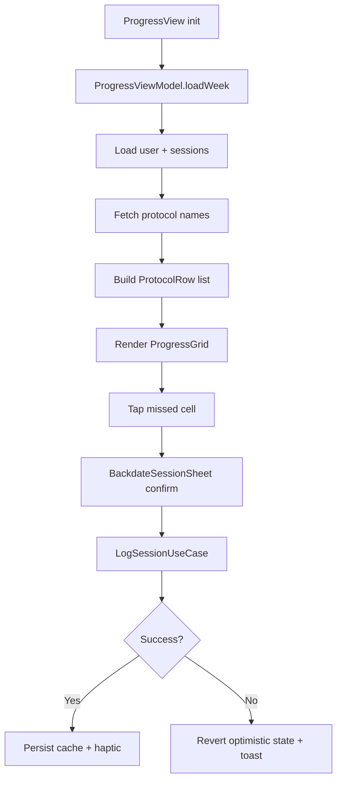

# Progress Screen Change Log

This document tracks the Progress screen implementation. Keep it current as the app evolves.

## What changed

### New state and view model
- Added `ProgressState`, `ProgressLoaded`, `ProtocolRow`, `DayCell`, and `CellState` to model the week grid.
- Implemented `ProgressViewModel` to load user/stack + week sessions, build rows, handle offline cache, and refresh on app resume.
- Added backdate flow with optimistic UI updates and rollback on failure.

### New UI and widgets
- Implemented `ProgressView` with AppGridBackground, header, offline banner, grid card, and bottom navigation.
- Added `ProgressGrid` with day headers, protocol name column, and day cells.
- Added `ProgressDayCell` visuals for completed/not-done/future states with subtle animation.
- Added `BackdateSessionSheet` to confirm logging missed sessions.

### Cache and offline behavior
- Added per-user, per-week cache (`CachedWeekProgressStore`) storing protocol names and completed days.
- Progress hydrates from cached user + week cache when offline, and refreshes on reconnect/resume.

### Navigation behavior
- Progress route uses `/week` and integrates with bottom navigation via `HomeBottomTabCoordinator`.

### Supporting domain/data updates
- Session logging uses **client-generated UUIDs** for idempotent offline sync via `SessionDraft` and `SessionInsertDto`.
- The `sessions.id` column is UUID (via migration `20260109170000_sessions_uuid_id.sql`).
- Repository handles duplicate key conflicts as idempotent success (fetches existing session).
- Log session use case raises `SessionLoggedEvent` after persistence.

### Layout hardening
- Fixed Progress grid overflow by making the grid horizontally scrollable on narrow widths, preserving name column visibility and min cell sizes.

### Tests
- Added `ProgressViewModel` unit tests for `computeCellState`.
- Added `ProgressGrid` widget test for narrow-width layout (no overflow, cell count).
- Added `DateTime` extensions tests for week boundaries.

## Flow diagram

## What did not change (intentionally)

### Not implemented yet
- Month/quarter views or historical ranges beyond the current week.
- Multi-session/day visualization (still binary completed).
- Legend or detailed stats panels on this screen.
- Localization for Progress copy (inline strings remain).

### Existing system behavior unchanged
- Authentication/bootstrap and routing flow.
- Domain invariants for Protocol/User/Session.

## Files added or replaced

### Added
- `app/lib/progress/progress_state.dart`
- `app/lib/progress/progress_view_model.dart`
- `app/lib/progress/progress_view.dart`
- `app/lib/progress/widgets/progress_grid.dart`
- `app/lib/progress/widgets/progress_day_cell.dart`
- `app/lib/progress/widgets/backdate_session_sheet.dart`
- `app/lib/progress/data/cached_week_progress_store.dart`
- `app/lib/core/utils/date_time_extensions.dart`
- `app/test/progress/progress_view_model_test.dart`
- `app/test/progress/widgets/progress_grid_test.dart`
- `app/test/core/utils/date_time_extensions_test.dart`

### Replaced
- None.

### Updated
- `app/lib/home/home_bottom_tab_coordinator.dart`
- `app/lib/home/widgets/home_status_dot.dart`
- `app/lib/features/session/domain/use_cases/log_session_use_case.dart`
- `app/lib/features/session/domain/entities/session.dart`
- `app/lib/features/session/domain/entities/session_draft.dart`
- `app/lib/features/session/data/dtos/session_insert_dto.dart`
- `app/lib/features/session/data/data_sources/session_remote_data_source.dart`
- `app/lib/features/session/data/repositories/session_repository_impl.dart`
- `app/lib/config/locator_config.dart`

## Auto updates and external changes
- `flutter analyze` resolved and downloaded packages. This did not modify tracked source files.
- `flutter test test/progress/widgets/progress_grid_test.dart` resolved and downloaded packages. This did not modify tracked source files.

## Testing
- `flutter analyze`
- `flutter test test/progress/widgets/progress_grid_test.dart`
- `flutter test test/progress/progress_view_model_test.dart`

## Update checklist
- When grid layout changes, update `ProgressGrid` tests and width calculations.
- When session schema changes, update `SessionInsertDto` and `SessionDto`.
- When offline behavior changes, update `_loadWeek` and cache read/write paths in `ProgressViewModel`.
- Keep `spec_progress_screen.md` and this document aligned.

